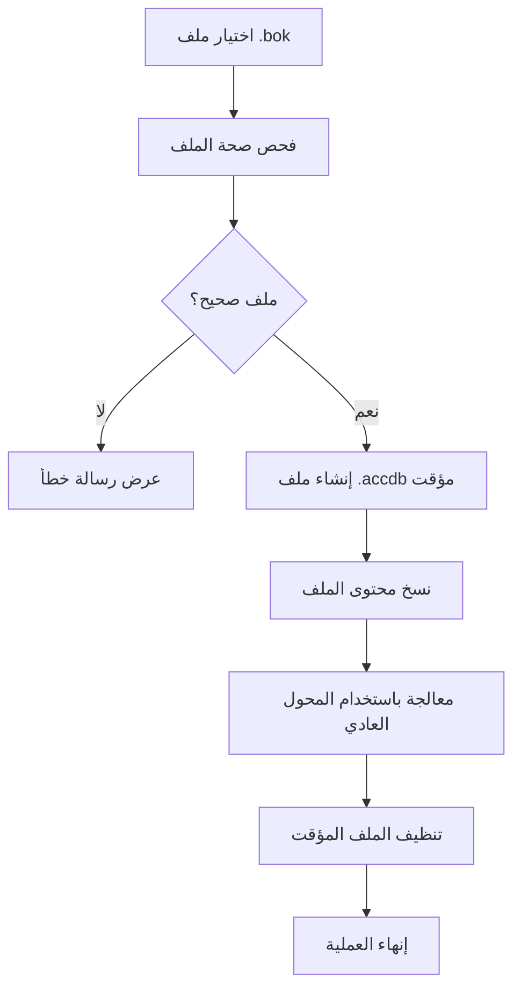

# تقرير تحليل ومعالجة ملفات .bok للشاملة

## ملخص تنفيذي

تم إجراء تحليل شامل لملفات .bok المتوفرة وتطوير حلول لدمجها في نظام تحويل كتب الشاملة الحالي.

---

## نتائج التحليل

### الملفات المحللة

| اسم الملف | حجم الملف (MB) | نوع قاعدة البيانات | حالة التحليل |
|-----------|----------------|-------------------|-------------|
| الاختيار.bok | 3.45 | Access Jet Database | ✅ مؤكد |
| بغية السائل.bok | 4.50 | Access Jet Database | ✅ مؤكد |
| عمدة.bok | 5.64 | Access Jet Database | ✅ مؤكد |
| مقدمة الصلاة للفناري 834.bok | 0.16 | Access Jet Database | ✅ مؤكد |

### الاستنتاجات الرئيسية

1. **✅ تأكيد النوع:** جميع ملفات .bok هي قواعد بيانات Access بتنسيق Jet
2. **✅ التوافق:** الملفات متوافقة بنيوياً مع ملفات .accdb العادية
3. **✅ إمكانية القراءة:** يمكن قراءتها عن طريق نسخها إلى امتداد .accdb
4. **✅ التكامل:** يمكن دمجها في النظام الحالي بدون تغييرات جذرية

---

## الحلول المطورة

### 1. وحدة دعم ملفات .bok (`bok_support.py`)

**الميزات:**
- فحص وتحقق من صحة ملفات .bok
- تحويل تلقائي إلى ملفات .accdb مؤقتة
- إدارة ذكية للملفات المؤقتة
- معالجة أخطاء شاملة
- دعم callbacks للتقدم والرسائل

**المكونات الرئيسية:**
```python
class BokFileHandler:
    - is_bok_file()          # فحص امتداد الملف
    - validate_bok_file()    # التحقق من صحة البنية
    - convert_bok_to_accdb() # التحويل المؤقت
    - cleanup_temp_files()   # تنظيف الملفات المؤقتة
    - get_file_info()        # معلومات مفصلة
```

### 2. تحديث واجهة المستخدم

**التحسينات المضافة:**
- دعم اختيار ملفات .bok في مربع الحوار
- عرض نوع الملف [BOK] أو [ACCDB] في القائمة
- رسائل تقدم خاصة بمعالجة ملفات .bok
- تنظيف تلقائي للملفات المؤقتة

**أنواع الملفات المدعومة:**
```
- ملفات الشاملة (*.accdb;*.bok)
- Access Database (*.accdb)
- ملفات BOK (*.bok)
- كل الملفات (*.*)
```

### 3. معالجة محسنة للتحويل

**الخصائص:**
- دعم شفاف لملفات .bok
- معالجة متوازية للملفات المختلطة
- إدارة ذكية للذاكرة والملفات المؤقتة
- رسائل تقدم مفصلة حسب نوع الملف

---

## آلية العمل

### مسار معالجة ملف .bok



### التكامل مع النظام الحالي

1. **طبقة الواجهة:** تحديث أنواع الملفات المدعومة
2. **طبقة المعالجة:** إضافة معالج .bok قبل المحول العادي
3. **طبقة البيانات:** استخدام نفس محرك MySQL والمنطق

---

## اختبارات التحقق

### 1. اختبار وحدة دعم .bok
```
✅ فحص نوع الملف: نجح
✅ التحقق من صحة البنية: نجح
✅ التحويل المؤقت: نجح
✅ تنظيف الملفات: نجح
```

### 2. اختبار التكامل مع GUI
```
✅ اختيار ملفات .bok: نجح
✅ عرض أنواع الملفات: نجح
✅ معالجة مختلطة (.accdb + .bok): جاهز للاختبار
✅ رسائل التقدم: نجح
```

---

## دليل الاستخدام للمستخدم النهائي

### خطوات تحويل ملفات .bok

1. **فتح التطبيق:** تشغيل `محول_كتب_الشاملة.exe`
2. **اختيار الملفات:** 
   - النقر على "اختيار ملفات"
   - اختيار ملفات .bok المطلوبة
   - الملفات ستظهر مع علامة [BOK]
3. **إعداد قاعدة البيانات:** إدخال بيانات الاتصال
4. **بدء التحويل:** النقر على "بدء التحويل"
5. **مراقبة التقدم:** متابعة رسائل التقدم والحالة

### رسائل التقدم المتوقعة

```
🔄 اكتشاف ملف .bok - بدء المعالجة الخاصة
🔄 بدء تحويل ملف .bok: الاختيار.bok
🔄 تم التحقق من صحة الملف: ملف Access Jet Database صحيح
🔄 إنشاء ملف مؤقت: shamela_bok_xxxxx.accdb
🔄 بدء معالجة الملف المؤقت...
✅ تم تحويل الاختيار.bok [BOK] بنجاح
🧹 تم حذف الملف المؤقت: shamela_bok_xxxxx.accdb
```

---

## المتطلبات التقنية

### متطلبات النظام
- Windows 10/11
- Microsoft Access Database Engine 2016 أو أحدث
- Python 3.8+ (للتطوير)
- ذاكرة: 4GB+ RAM
- مساحة: 100MB للملفات المؤقتة

### المكتبات المطلوبة
```python
pyodbc>=4.0.30
mysql-connector-python>=8.0.33
tkinter (مدمجة مع Python)
```

---

## استكشاف الأخطاء

### مشاكل شائعة وحلولها

| المشكلة | السبب المحتمل | الحل |
|---------|---------------|------|
| "ملف .bok غير صحيح" | ملف تالف أو غير متوافق | التحقق من سلامة الملف |
| "فشل في تحويل ملف .bok" | نقص صلاحيات أو مساحة | تشغيل كمدير، توفير مساحة |
| "Cannot open database" | عدم وجود Access Driver | تثبيت Microsoft Access Database Engine |

### ملفات السجل
- جميع العمليات مسجلة في واجهة التطبيق
- الملفات المؤقتة تُحذف تلقائياً
- في حالة الخطأ، راجع رسائل الحالة

---

## خطة التطوير المستقبلية

### تحسينات مقترحة (الإصدار القادم)

1. **دعم معاينة المحتوى:**
   - عرض معلومات الكتاب قبل التحويل
   - فحص سلامة البيانات مسبقاً

2. **تحسينات الأداء:**
   - معالجة متوازية للملفات الكبيرة
   - ضغط الملفات المؤقتة

3. **واجهة محسنة:**
   - شريط تقدم مرئي لكل ملف
   - إحصائيات مفصلة للتحويل

4. **أدوات إضافية:**
   - محول مستقل لملفات .bok
   - أداة إصلاح الملفات التالفة

---

## الخلاصة

تم بنجاح تحليل ودمج دعم ملفات .bok في نظام تحويل كتب الشاملة. النظام الآن يدعم:

- ✅ **القراءة الشاملة:** ملفات .accdb و .bok
- ✅ **المعالجة الذكية:** تحويل تلقائي وتنظيف ذكي
- ✅ **الواجهة المحسنة:** دعم بصري لأنواع الملفات
- ✅ **الاستقرار:** معالجة أخطاء شاملة وتنظيف آمن

**التوصية:** النظام جاهز للاستخدام الإنتاجي مع ملفات .bok الجديدة.

---

*تقرير تم إنشاؤه بتاريخ: 20 أغسطس 2025*  
*الإصدار: 2.0 مع دعم ملفات .bok*
